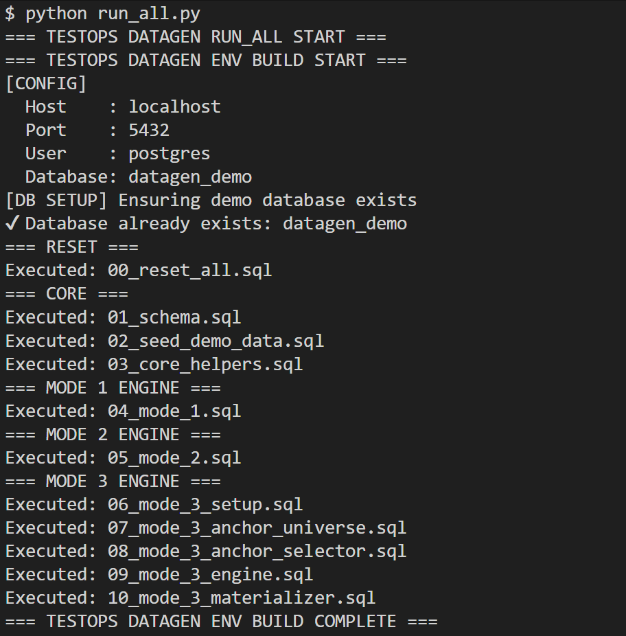
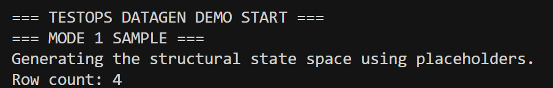
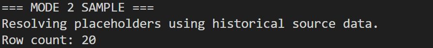
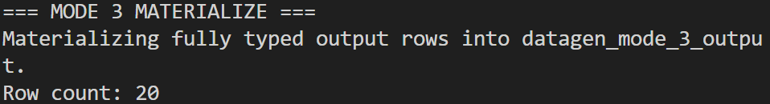

# 🧪 Test Data Generation Framework (DataGen)

## 🧩 Overview

The **Test Data Generation Framework (DataGen)** is a metadata-driven system for generating structured, realistic, and scalable test datasets directly from database schemas.

It enables controlled expansion of test coverage by combining:
- deterministic parameter space generation
- historical-data resolution
- registry-driven candidate resolution

Designed for **data testing, validation, and simulation workflows**.

---

## 🚨 Problem

Testing data-heavy systems often suffers from:

- Limited or static datasets
- Poor coverage of edge cases
- Unrealistic synthetic data
- Manual effort to prepare test scenarios

This results in:
- missed defects
- low confidence in outputs
- inefficient testing cycles

---

## 💡 Solution

DataGen introduces a **3-mode generation model**:

### 🔹 Mode 1 — Structural Parameter Space
- Extracts valid value domains from schema (booleans, CHECK-constraint enums via `pg_get_constraintdef` parsing)
- Generates the full deterministic cartesian combination across every bool/enum-typed column
- Uses placeholders (`@column_name`) for every other column — business keys, FKs, free text
- Zero rows resolved; this is the raw structural coverage space, meant to be tailored by hand or fed into Mode 2/3

👉 Output: full structural state space for a target table, driven entirely by schema
introspection — no table-specific code required.

---

### 🔹 Mode 2 — Historical Resolution
- Regenerates the same param space as Mode 1, then resolves **every currently-unresolved
  column** — business keys, FKs, dates, and free text alike — using the target table's own
  historical data
- All unresolved columns are resolved together as a single whole-row tuple (not
  independently per column), pulled as `DISTINCT` combinations that actually occurred
  together — the strongest possible relational-integrity guarantee, since it's literally
  data that co-occurred
- Takes a **multiplier** parameter: if the base param space is N rows and multiplier=M,
  Mode 2 generates up to N×M rows — pass 1 resolves the full param space with the 1st
  distinct historical tuple, pass 2 with the 2nd, and so on
- If fewer than M distinct historical tuples exist, generation stops there — no repeats,
  no partial rows. The effective multiplier is capped at whatever data is actually available

👉 Output: realistic, production-aligned datasets, scaled by however many distinct
historical scenarios you want represented.

---

### 🔹 Mode 3 — Candidate Resolution
- Same mechanic as Mode 2, but instead of sourcing from the target table's history, it
  resolves against a **user-supplied candidates table** — a curated dataset the user has
  prepared in advance (e.g. a maximum-coverage set of legal value combinations)
- A registry (`datagen.mode_3_resolution_map`) declares, per target table, exactly which
  placeholder columns to resolve and which single candidates table holds legal values for
  all of them together, as one tuple
- Same multiplier/cap semantics as Mode 2: pass N uses the Nth candidate row (ordered by
  the candidates table's natural column order), capped at however many candidate rows exist
- If no registry entry exists for a table, Mode 3 gracefully falls back to Mode 1
  semantics — every placeholder stays unresolved rather than erroring

👉 Output: realistic datasets generated from data **you** curate and supply, rather than
mined from production history — useful when you want coverage beyond what's actually
happened yet, or when no historical data exists at all.

**Scope note:** Mode 3 wires registered candidates into the param space and validates that
the required columns exist; *curating which values (and combinations) belong in a
candidates table* is the caller's responsibility. Mode 3 doesn't distinguish business
keys, dates, or free text — any column with a registered mapping is resolved the same way,
which is what keeps the "no hardcoding" claim genuinely true.

---

## ⚙️ Features

- Metadata-driven (no hardcoding) — all three modes work against any table via schema
  or registry introspection, not table-specific code
- Schema introspection (auto-detect booleans, CHECK-constraint domains)
- Historical-tuple and registry-driven candidate resolution, both scaled by a multiplier
  with automatic, no-repeat capping when source data runs out
- Deterministic full cartesian coverage of the structural param space
- Export to `.xlsx` for every mode — real tabular columns, ready to hand off as test data
  or validation evidence
- Fully reproducible environment
- Idempotent setup and reset
- PostgreSQL-native (SQL + Python orchestration)

---

## 📁 Repository Structure

```
.
├── core/                   # shared internals, not run directly
│   ├── config.py
│   ├── db.py
│   ├── demo_helpers.py
│   ├── export.py
│   └── verification.py
├── scripts/                # entry points -- everything you actually run
│   ├── 00_init_env.py
│   ├── 01_create_env.py       # Layer 1: business environment only
│   ├── setup_datagen.py       # Layer 2: install the DataGen engine
│   ├── setup_candidates.py    # Layer 3: candidates setup (demo seed)
│   ├── run_all.py             # convenience wrapper: all 3 layers + demo
│   ├── reset_all.py
│   ├── 02_run_demo.py
│   └── 03_reset_env.py
├── requirements.txt
├── query_book.sql

├── sql/
│   ├── 00_reset_all.sql
│   ├── 01_schema.sql                              # Layer 1
│   ├── 02_seed_demo_data.sql                       # Layer 1
│   ├── 03_core_helpers.sql                         # Layer 2
│   ├── 04_mode_1.sql                               # Layer 2
│   ├── 05_mode_2.sql                               # Layer 2
│   ├── 06_mode_3.sql                               # Layer 2
│   ├── 07_seed_candidates_demo.sql                 # Layer 3 (transactions)
│   ├── 08_seed_candidates_companies_securities.sql # Layer 3 (companies, securities)
│   └── mode_3_experimental/      # legacy pre-hardening code, not part of the engine
```

---

## 🚀 How to Run

### 1. Clone repo

```bash
git clone https://github.com/testops-intelli/datagen-test-data-framework.git
cd datagen-test-data-framework
```

### 2. Setup environment

```bash
python -m venv venv
source venv/Scripts/activate
pip install -r requirements.txt
```

### 3. Initialize config

```bash
python scripts/00_init_env.py
```

Edit `.env` (created at repo root):

```
PG_PASSWORD=your_password
PG_DATABASE=datagen_demo
MODE_2_MULTIPLIER=2
MODE_3_MULTIPLIER=2
```

### 4. Run full demo

```bash
python scripts/run_all.py
```

This builds the environment, runs all three modes against the demo `transactions`
table, prints a preview to the console, and exports each mode's output to
`outputs/mode_1_output.xlsx`, `outputs/mode_2_output.xlsx`, `outputs/mode_3_output.xlsx`
(all relative to the repo root, regardless of which script you run from `scripts/`).

### 4b. Or run it layer by layer

`run_all.py` is a convenience wrapper around three independent, separately-runnable
steps — useful for seeing exactly what "installing DataGen" actually touches, or for
running against your own tables instead of the demo ones:

```bash
# Layer 1: the business environment (companies/securities/transactions +
# historical data) -- simulates a database that already exists, with zero
# DataGen involvement.
python scripts/01_create_env.py

# Layer 2: installs the DataGen engine onto that database -- schema, helper
# functions, Mode 1/2/3. Mode 1 and Mode 2 work immediately after this step;
# Mode 3's registry table exists but is empty.
python scripts/setup_datagen.py

# Layer 3: candidates setup -- the one manual step a DataGen user performs
# themselves. Seeds the demo candidates tables/registrations so Mode 3 works
# out of the box; for your own tables, this is where you'd instead build and
# register your own candidates table (see "Registering a New Table" below).
python scripts/setup_candidates.py

# Then run the demo queries / export as usual
python scripts/02_run_demo.py
```

### 5. Reset environment

```bash
python scripts/reset_all.py
```

### 6. Explore with the query book

For a guided tour of every mode against every demo table (with multiplier and
capping behavior called out inline), see `query_book.sql` at the repo root — run
it in a single `psql` session or query tool tab (materializer procs use temp
tables, which only persist within the session that created them).

## 📸 Demo Output

### Environment Build


> ⚠️ The Mode 1/2/3 screenshots below predate this hardening pass (old Mode 2/3
> semantics, no multiplier, no xlsx export). Kept for reference only — regenerate
> against `run_all.py` before using this repo in a live pitch.





---

## 🔌 Registering a New Table for Mode 3

Mode 1 and Mode 2 already work against any table with no configuration — they're pure
schema/history introspection. Onboarding a new table for Mode 3 resolution is a **data
change, not a code change**:

1. Build (or point to) a candidates table whose columns are named identically to the
   placeholder columns you want resolved, containing legal/valid combinations. By
   convention, candidates tables live under the `datagen` schema (alongside the
   registry table itself) rather than `public`, so curated support data stays
   separate from your actual business tables — Mode 3 doesn't require this, though;
   `candidates_schema_name` can point anywhere.
2. Insert one row into `datagen.mode_3_resolution_map`:

```sql
INSERT INTO datagen.mode_3_resolution_map (
    target_schema_name, target_table_name,
    placeholder_columns_json,
    candidates_schema_name, candidates_table_name
) VALUES (
    'public', 'orders',
    '["customer_id","region_code","notes"]'::jsonb,
    'datagen', 'orders_candidates'
);
```

3. Call `datagen.mode_3('public', 'orders', 3)`. If a table has no registry entry, Mode 3
   simply leaves everything placeheld — you can onboard tables incrementally.

No SQL engine changes, no new stored procedures, no per-table Python — this is the same
mechanism the demo `transactions` table uses in `sql/07_seed_candidates_demo.sql`.

---

## 🎯 Use Cases

- Test data generation for QA pipelines
- Regression testing data coverage
- Data validation frameworks
- Simulation of financial / transactional workflows
- ETL and pipeline testing
- Scenario expansion beyond production data

---

## 🧠 Positioning

Part of the **TestOps Intelli** toolkit:
- ART (Regression)
- DataGen
- Workflow Simulator
- ETL / Pipelines
- Analytics Layer

---

## 📌 Current State

- ✅ End-to-end runnable demo
- ✅ Public reproducible environment
- ✅ Hardened 3-mode engine: Mode 1 (deterministic param space), Mode 2
  (historical-tuple resolution with multiplier), Mode 3 (registry-driven candidate
  resolution with multiplier) — fully metadata-driven, no table-specific hardcoding
- ✅ `.xlsx` export for every mode's output
- 🧪 Pre-hardening code (old Mode 3 anchor-universe design) retired from the active
  engine; kept under `sql/mode_3_experimental/` for reference only — see that folder's
  README

---

## 📄 License

This project is licensed under the [MIT License](LICENSE).

## Author

Nicholas Papadimitris
